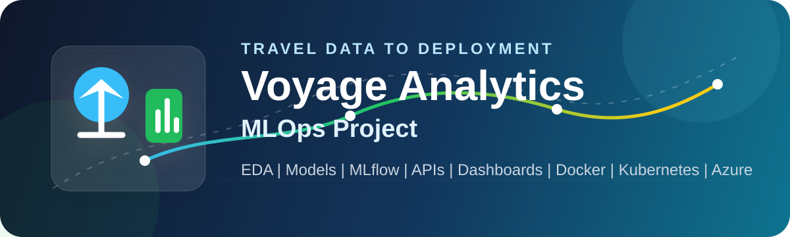

<p align="center">
  
</p>

<div align="center">

# Voyage Analytics MLOps

**Travel analytics project with notebooks, model training, APIs, dashboards, and deployment workflow.**


</div>

---

## Project Overview

Voyage Analytics is a travel-domain machine learning project. It starts with data analysis in Colab notebooks, then moves into a local MLOps setup where models are trained, tracked, served through APIs, shown through Streamlit apps, and prepared for container-based deployment.

The project covers three main use cases:

- Flight price prediction
- Hotel recommendation
- Gender classification

The notebooks and the local MLOps code have different roles. The notebooks show the analysis and model experimentation work. The local MLOps pipeline shows how the selected work can be organized into repeatable scripts, APIs, dashboards, containers, and deployment files.

The flight regression notebook and the local serving workflow also have separate model-selection results. The W&B notebook experiment selected Random Forest Regularized as its tracked notebook artifact. The local MLflow workflow retrained the candidates independently and promoted XGBoost Regularized as the model used by the Flask API and deployment flow.

---

## What Is Inside

| Area | What it contains |
| --- | --- |
| Data analysis | EDA notebook for understanding flight, hotel, and user data |
| Model notebooks | Colab notebooks for model building and experimentation |
| Local training | Python training script for flight price regression |
| Model tracking | MLflow experiment tracking and local model workflow |
| APIs | Flask apps for prediction and recommendation services |
| User interface | Streamlit dashboards for interacting with the models |
| Automation | Airflow DAG and Jenkins pipeline files |
| Deployment | Docker Compose, Kubernetes, and Azure deployment files |
| Monitoring | Dataset drift checks and workflow monitoring scripts |

---

## Repository Structure

| Folder | Purpose |
| --- | --- |
| `EDA_Notebook_` | Exploratory data analysis notebook |
| `Flight Price Prediction Regression ML Model` | Flight price regression notebook |
| `hotel_recommendation_ML_model` | Hotel recommendation notebook |
| `Gender_classification_ML_model` | Gender classification notebook |
| `local_training` | Local flight price training code |
| `MLops pipeline` | Flask, Streamlit, MLflow, Airflow, Jenkins, Docker, Kubernetes, and Azure files |
| `dataset` | Travel dataset and baseline files used by the project |

---

## Documentation

Detailed component guides are available in the `docs` folder:

| Guide | Purpose |
| --- | --- |
| [Project Overview](docs/01_project_overview.md) | Explains the project goal and complete workflow |
| [Notebooks and Modeling](docs/02_notebooks_and_modeling.md) | Explains why notebooks and local MLOps code both exist |
| [Local Training and MLflow](docs/03_local_training_and_mlflow.md) | Covers flight model training, tracking, and model export |
| [APIs and Streamlit Apps](docs/04_flask_apis_and_streamlit_apps.md) | Covers backend APIs and browser dashboards |
| [Docker Compose Setup](docs/05_docker_compose_local_setup.md) | Explains the local service orchestration layer |
| [Airflow Pipeline](docs/06_airflow_training_pipeline.md) | Covers the scheduled/manual training workflow |
| [Jenkins CI/CD](docs/07_jenkins_ci_cd.md) | Covers validation, build, and deployment pipeline steps |
| [Kubernetes and Azure](docs/08_kubernetes_and_azure_deployment.md) | Covers cloud deployment structure |
| [Monitoring and Drift Checks](docs/09_monitoring_and_drift_checks.md) | Covers dataset drift, health checks, and workflow monitoring |
| [User Guide and Troubleshooting](docs/10_user_guide_and_troubleshooting.md) | Gives practical run commands and common fixes |

---

## Project Flow

```text
Travel Dataset
   -> EDA Notebooks
   -> Model Training
   -> MLflow Tracking
   -> Flask APIs
   -> Streamlit Apps
   -> Docker Compose
   -> Jenkins / Kubernetes / Azure
```

---

## Main Services

| Service | Local URL |
| --- | --- |
| Gateway | `http://localhost:8090` |
| Flight price API | `http://localhost:5002` |
| Flight Streamlit app | `http://localhost:8501` |
| Hotel recommendation API | `http://localhost:5001` |
| Hotel Streamlit app | `http://localhost:8502` |
| Gender classification API | `http://localhost:5003` |
| Gender Streamlit app | `http://localhost:8503` |
| Jenkins | `http://localhost:8081` |

---

## Run Locally

The default Docker Compose command starts the main serving layer: Flask APIs, Streamlit apps, and the local gateway. The small serving model artifacts required by these apps are included in the repository so a fresh clone can start the demo without manually copying model files.

Go to the MLOps folder:

```bash
cd "MLops pipeline"
```

Start the local services:

```bash
docker compose up --build
```

Open the local gateway:

```text
http://localhost:8090
```

Stop the services:

```bash
docker compose down
```

Run the MLflow experiment workflow:

```bash
docker compose --profile mlflow up --build
```

This workflow can regenerate and promote the flight price model artifact used by the serving layer.

Run the local validation job:

```bash
docker compose --profile mlops run --rm flight-validation
```

Start Jenkins for the CI/CD workflow:

```bash
docker compose --profile jenkins up --build
```

---

## Tech Stack

<p>
  
</p>

Additional tools used in the workflow:

- Pandas and scikit-learn for data processing and model training
- MLflow for experiment tracking
- Airflow for workflow orchestration
- Streamlit for dashboards
- Docker Compose for local service orchestration
- Kubernetes and Azure for deployment support

---

## Validation Scope

The flight dataset contains highly structured pricing relationships and many repeated feature-target patterns. The notebook removes repeated model-input and price combinations before its chronological W&B comparison. The local workflow also records time-based and unseen-group evaluation results before promoting its serving model.

These metrics show performance within the provided project dataset. They should not be treated as guaranteed performance on external airline data with different routes, agencies, demand conditions, or pricing rules.

---

## Final Output

This repository shows an end-to-end travel analytics workflow:

- notebooks for data analysis and model building
- reusable local training code
- tracked ML experiments
- prediction and recommendation APIs
- Streamlit user apps
- Docker-based local setup
- CI/CD and cloud deployment files
- monitoring and drift-checking scripts
